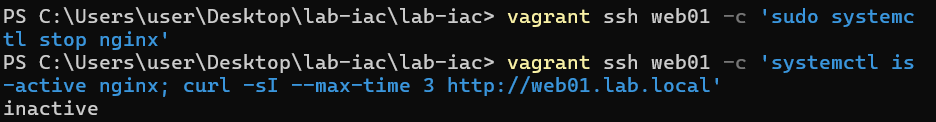

# README

# Lab Infrastructure as Code

## 프로젝트 소개

소규모 사내 환경을 가정하여 내부 DNS/NTP, Web, DB 서버를 구축하고, Vagrant와 Ansible을 이용해 전체 인프라를 코드로 재현할 수 있도록 구성한 개인 랩 프로젝트입니다.

이후 Prometheus/Grafana를 이용해 서버 상태와 서비스 상태를 모니터링하고, 장애 상황을 의도적으로 발생시켜 탐지·분석·복구 과정을 검증했습니다.

노트북 한 대(RAM 12GB)에서 VMware Workstation Pro로 VM 5대를 동시에 띄워야 하는 제약이 있어, 리소스 배분과 idempotent한 프로비저닝 설계에 신경을 많이 썼습니다.

## 프로젝트 목표

- 사내 인프라의 최소 구성(DNS/NTP, Web, DB)을 코드로 정의하고, `vagrant destroy` 후에도 동일한 상태로 재현 가능하게 만든다.
- 반복 실행해도 결과가 바뀌지 않는 idempotent한 Ansible 플레이북을 작성한다.
- 인프라 상태를 눈으로 확인할 수 있도록 모니터링 스택을 구축한다.
- 실제로 장애를 발생시켜 탐지부터 복구까지의 대응 절차를 문서화한다.

## 아키텍처

```
                              monitor01 (192.168.56.15)
                    ┌─────────────────────────────────────┐
                    │  Docker                             │
                    │  ├─ Prometheus                      │
                    │  ├─ Grafana                         │
                    │  └─ Blackbox Exporter               │
                    └───────────────┬─────────────────────┘
                                     │ node_exporter 스크래핑 (:9100)
                                     │ blackbox 프로브 (HTTP / DNS / TCP)
              ┌──────────────────────┼──────────────────────┐
              │                      │                      │
          dns01 (.11)           web01 (.12)             db01 (.13)
          BIND9 / chrony        nginx                    MariaDB
              │
       client01 (.14) — 검증용 클라이언트 (DNS 조회, MariaDB 원격 접속 테스트)
```

- 각 VM은 `ansible_local` 방식으로 자기 자신의 role만 로컬에서 실행 (VM 간 SSH 신뢰 관계 불필요)
- `client01`은 다른 서비스에 의존하지 않는 검증용 클라이언트로, DNS 조회·DB 원격 접속 테스트에 사용
- `monitor01`은 나머지 4대를 감시하는 역할로, node_exporter(서버 상태)와 blackbox_exporter(서비스 상태)를 통해 두 계층을 모두 프로브를 수행한다

## 서버 구성

| 호스트명 | IP | 사양 | 역할 |
| --- | --- | --- | --- |
| dns01 | 192.168.56.11 | mem 1024MB | 내부 DNS(BIND9), NTP |
| web01 | 192.168.56.12 | mem 1024MB | Web 서버 |
| db01 | 192.168.56.13 | mem 1536MB | MariaDB |
| client01 | 192.168.56.14 | mem 1024MB | 서비스 검증용 클라이언트 |
| monitor01 | 192.168.56.15 | mem 768MB | Prometheus, Grafana (Docker) |

## 기술 스택

- **가상화/프로비저닝**: VMware Workstation Pro, Vagrant (Windows 네이티브), Ansible (`ansible_local`)
- **DNS/NTP**: BIND9, chrony
- **Web**: nginx
- **DB**: MariaDB
- **모니터링**: Docker, Docker Compose, Prometheus, Grafana, Node Exporter, Blackbox Exporter
- **OS**: Rocky Linux

## 네트워크 구성

VMware Host-only 어댑터로 `192.168.56.0/24` 대역을 구성하고, dns01을 내부 DNS 서버로 지정해 모든 VM이 `*.lab.local` 도메인으로 서로를 인식하도록 했습니다. 정방향/역방향 존을 모두 관리해 이름 조회와 PTR 조회가 둘 다 가능합니다.

## IaC 구성

### Vagrant

`Vagrantfile`에 VM 정보를 해시(`VMS`)로 정의해 이름/IP/메모리/role을 한 곳에서 관리합니다. 각 VM의 `role`에 따라 `ansible.groups`가 자동으로 매핑되어, `site.yml`에서 해당 role의 play만 실행되도록 분기합니다.

### Ansible

`ansible/` 아래에 역할별로 role을 분리했습니다: `common`, `dns`, `web`, `db`, `client`, `node_exporter`(전체 VM 공통), `monitor`(monitor01 전용). `site.yml`이 groups 기준으로 각 VM에 맞는 role만 적용합니다. VMware 공유폴더가 불안정해 `ansible/` 디렉터리는 file provisioner로 각 VM에 업로드하는 방식을 사용했습니다.

### Idempotency

- DB role은 root 비밀번호 변경 태스크에 `login_user`/`login_password`를 명시해, 비밀번호가 이미 바뀐 상태에서 재실행해도 실패하지 않도록 처리
- 패키지 설치(`dnf`) 태스크에는 `retries`/`delay`/`until`을 추가해 네트워크 지연으로 인한 일시적 실패에 대응

### Reproducibility

`vagrant destroy` 후 처음부터 `vagrant up`으로 재구축했을 때도 DNS 정방향/역방향 조회, Web `curl` 응답, client01 → db01 MariaDB 원격 접속이 모두 동일하게 성공하는 것을 확인했습니다.

## 서비스 구성

### DNS / NTP

BIND9로 `lab.local` 도메인의 정방향/역방향 존을 관리합니다. chrony로 내부 NTP 동기화도 함께 구성했습니다.

### Web

nginx 기반 Web 서버로, 기본 페이지 응답을 통해 서비스 정상 여부를 확인할 수 있게 구성했습니다.

### Database

MariaDB를 설치하고, root 계정 및 애플리케이션용 계정을 Ansible로 프로비저닝합니다. 비밀번호 등 민감 정보는 `group_vars/db.yml`에 분리하고 `.gitignore`로 저장소에서 제외했습니다(`.example` 파일만 커밋).

### Monitoring

monitor01에 Docker Compose로 Prometheus + Grafana + Blackbox Exporter를 구성했습니다.

- **Node Exporter** (전체 VM 공통 role): CPU/메모리/디스크/네트워크 등 서버 자체의 상태를 노출. Grafana에는 Node Exporter Full(대시보드 ID 1860)을 임포트해 시각화
- **Blackbox Exporter**: 서버가 살아있는 것과 서비스가 살아있는 것은 다른 문제이기 때문에 추가했습니다. node_exporter만으로는 예를 들어 nginx 프로세스만 죽고 VM 자체는 정상인 상황을 감지할 수 없어서, 실제 서비스 레벨의 상태를 다음 3개 모듈로 확인합니다.
    - `http_2xx`: web01에 HTTP GET 요청 (200 응답 확인)
    - `dns_lab`: dns01에 DNS 쿼리 (web01.lab.local A 레코드 조회)
    - `tcp_connect`: db01의 3306 포트 TCP 연결 확인

Prometheus가 blackbox_exporter를 프록시로 거쳐 각 대상을 프로브하는 구조라, `scrape_configs`에 `relabel_configs`로 실제 검사 대상(target)을 파라미터로 넘기도록 구성했습니다. 프로브의 실제 성공/실패는 Prometheus targets 페이지의 UP/DOWN이 아니라 `probe_success` 메트릭(1=성공, 0=실패)으로 판단합니다 — targets 페이지의 UP/DOWN은 blackbox_exporter 자신에 대한 scrape 성공 여부일 뿐이라, 검사 대상이 죽어도 blackbox_exporter 자체는 정상 응답하기 때문입니다.

## 장애 대응 시나리오

세 시나리오 모두 blackbox_exporter의 `probe_success` 메트릭을 탐지 기준으로 삼아 실제로 서비스를 중지·복구하며 검증했습니다.

### Scenario 01. Web 서비스 장애

**상황**



**탐지**


Prometheus Graph에서 위 쿼리 실행 시 값이 `0`으로 확인됨.

**원인 분석**


**복구**


**검증**


`curl http://web01.lab.local` 응답 재확인.

### Scenario 02. DNS 장애

**상황**


**탐지**


blackbox_exporter가 dns01에 web01.lab.local A 레코드를 조회하지 못해 실패로 기록됨.

**원인 분석**


**복구**


**검증**


### Scenario 03. DB 접속 장애

**상황**


**탐지**


db01:3306 TCP 연결 실패로 기록됨. 동시에 client01에서도 실제 접속이 끊기는 것을 확인:


**원인 분석**: MariaDB 프로세스 자체가 중지된 상태로, 포트 자체가 열려있지 않음.

**복구**


**검증**


client01에서 mysql 재접속 성공까지 확인.

## 검증 결과

- 클린 재구축(`vagrant destroy` → `vagrant up`) 후 DNS 정방향/역방향 조회, Web `curl` 응답, client01 → db01 MariaDB 원격 접속 전부 정상 통과
- Prometheus 타겟 5/5(dns01/web01/db01/client01/monitor01, node_exporter 기준) 전부 UP 상태 확인

```jsx
- Node Exporter: 5/5 targets UP
- Blackbox Exporter:
  - blackbox_http: 1/1 UP
  - blackbox_dns: 1/1 UP
  - blackbox_tcp: 1/1 UP
```


- blackbox_http / blackbox_dns / blackbox_tcp 3개 job 모두 1/1 up 확인
- Grafana Node Exporter Full 대시보드에서 5대 전체 인스턴스 전환 및 실시간 메트릭 표시 확인
- 장애 시나리오 3종(Web/DNS/DB) 모두 상황 재현 → `probe_success` 0으로 탐지 → 복구 → `probe_success` 1로 재확인까지 완료

## 트러블슈팅

### 01. WSL2 + VMware 통신 문제

Vagrant를 WSL2 환경에서 사용하려 했으나 VMware Utility와의 통신 문제로 VM 제어가 되지 않아, Windows 네이티브 Vagrant 설치로 전환했습니다.

### 02. VMware 공유폴더 불안정

VMware 공유폴더 방식이 불안정하게 동작해, `ansible/` 디렉터리를 file provisioner로 각 VM에 업로드하는 방식으로 변경했습니다.

### 03. named 간헐적 SERVFAIL

BIND가 간헐적으로 SERVFAIL을 반환하는 문제가 있었습니다. 원인은 VMware NAT 환경이 IPv6를 지원하지 않는데 named가 IPv6로 루트 서버에 질의를 시도하다 타임아웃이 발생하는 것이었습니다. `named.conf`에 `dnssec-validation no`를 설정하고, `/etc/sysconfig/named`에 `OPTIONS="-4"`를 추가해 IPv4 질의만 하도록 해결했습니다.

### 04. Docker 컨테이너의 내부 도메인 이름 해석 실패

Docker 기본 DNS로는 `*.lab.local` 이름을 해석하지 못해, `docker-compose.yml`에 `dns: 192.168.56.11`을 명시해 컨테이너가 내부 DNS 서버를 사용하도록 했습니다.

### 05. ansible_local 방식에서 인벤토리 그룹 순회의 한계

`ansible_local`은 각 VM이 자기 자신만 인벤토리에 등록하는 방식이라, Jinja 템플릿에서 `groups['lab']` 같은 전체 그룹 순회를 사용하면 각 VM 입장에서는 자기 자신밖에 보이지 않아 의도한 대로 동작하지 않았습니다. 모니터링 대상 목록처럼 “전체 호스트 목록”이 필요한 경우에는 `roles/monitor/defaults/main.yml`의 `monitored_hosts` 같은 고정 리스트로 관리하도록 변경했습니다.

### 06. VM 최초 부팅 직후  provisioner에서 간헐적 네트워크 실패

`Vagrantfile`의 `dnf install -y ansible-core`를 실행하는  provisioner가 VM 부팅 직후 가장 먼저 실행되는데, 이 시점에 네트워크가 완전히 안정되기 전이라 이미 등록되어 있던 외부 저장소(docker-ce repo) 메타데이터 갱신에서 간헐적으로 실패하는 경우가 있었습니다. 수동으로 같은 명령을 실행하면 정상 동작해 일시적인 타이밍 문제로 판단, 재시도 루프로 감쌌습니다.

```ruby
node.vm.provision "", inline: <<-
  for i in $(seq 1 15); do
    dnf install -y ansible-core && break
    echo "네트워크/DNS 준비 대기 중... ($i/15)"
    sleep 2
  done

```

### 09. Ansible handler 대신 register + when 패턴 사용

설정 파일이 바뀌었을 때만 컨테이너를 재시작하는 로직을 handler(`notify`)로 구현하려 했으나, monitor role에는 애초에 handler가 정의되어 있지 않아 에러가 났습니다. 기존 role이 각 템플릿 배포 태스크의 결과를 `register`로 저장해두고, 마지막에 `when: a.changed or b.changed`로 한 번에 재시작하는 패턴을 쓰고 있어 새로 추가한 태스크도 이 패턴에 맞춰 통일했습니다.

## 프로젝트를 통해 해결한 문제

- 제한된 리소스(RAM 12GB) 환경에서 5대 VM을 동시에 운용 가능하도록 메모리 배분을 설계
- `vagrant destroy` 이후에도 동일한 상태로 재현 가능한 idempotent 인프라 코드 작성
- 단일 서버가 아닌 여러 서비스(DNS, Web, DB)가 서로 의존하는 환경에서 실제로 발생하는 네트워크/이름 해석 문제를 직접 진단하고 해결
- 모니터링 스택을 통해 인프라 상태를 정량적으로 확인 가능한 가시성 확보

## 실행 방법

```bash
# 전체 인프라 구성
vagrant up

# 특정 VM만 구성
vagrant up dns01

# 프로비저닝 재적용 (코드 수정 후)
vagrant provision dns01

# 전체 삭제 후 클린 재구축
vagrant destroy -f
vagrant up
```

접속 정보:

- DNS 조회 확인: `dig @192.168.56.11 web01.lab.local`
- Grafana: `http://192.168.56.15:3000`

## 향후 개선

- FreeIPA를 이용한 중앙 인증 체계 도입 (리소스 부담이 커서 별도 시점에 진행 예정)
- -Ansible을 이용한 장애 대응 자동화 (현재 ansible_local 구조에서는 SSH 기반 중앙 제어 방식으로 전환이 선행되어야 함)